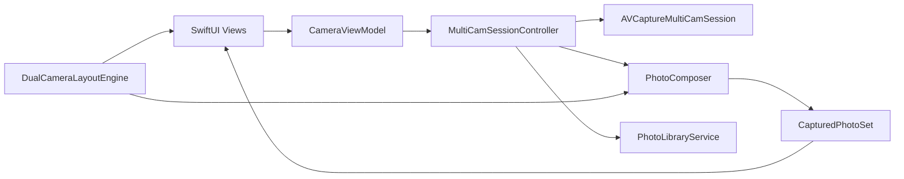

# 双摄相机架构

## 分层与职责

- `CameraViewModel`：唯一的 SwiftUI 状态入口，保存设置，处理倒计时、场景状态和系统设置跳转。
- `MultiCamSessionController`：只负责 AVFoundation 配置、会话状态、镜头切换、对焦、缩放、捕获事务和恢复。所有 AVCapture 会话变更均在 `com.taoking.dualcamera.session` 串行队列完成。
- `DualCameraLayoutEngine`：把布局样式、画中画位置和尺寸转换为画布上的帧；预览层与 `PhotoComposer` 调用同一算法。
- `PhotoComposer`：在独立队列合成成片，完成后回主线程交付。
- `PhotoLibraryService`：请求 add-only 权限，并按用户选择保存成片或成片加原图。
- `CameraPreferences`：持久化布局、比例、镜像、网格、倒计时、质量和保存选项。

## 拍照事务

1. 会话队列生成 `CaptureTransaction`（UUID、期望前／后位置、开始时间），并启动 4 秒超时。
2. 两个 `AVCapturePhotoOutput` 并发请求照片；每个 delegate 仅持有到对应回调完成。
3. 回调按 UUID 写入图像或错误。仅当两个位置均已返回时才结束事务。
4. 成功时先暂停实时会话，再在 `PhotoComposer` 合成并显示预览；后台或中断会使合成结果失效。失败、超时和取消只清理当前事务并恢复可拍状态。

这是一项近同步设计：共享事务保证配对关系，但不能承诺严格相同曝光时间。

## 布局规则

- 画中画：后摄铺满成片画布，前摄窗口按小／中／大比例显示，可拖动并自动约束、吸附到角落。
- 左右分屏：后摄在左、前摄在右；上下分屏：后摄在上、前摄在下。
- 前摄预览镜像和前摄成片镜像分开设置。所有布局参数会在用户调整后写入 `UserDefaults`。

## 生命周期与恢复

- 后台：停止会话，取消拍照事务，结束录制处理。
- 激活：仅当没有照片／视频预览覆盖时恢复会话。
- `AVCaptureSessionWasInterrupted`：取消事务并提示；`InterruptionEnded` 后尝试恢复。
- `mediaServicesWereReset`：清理连接、输出与输入后重新配置。其他运行时错误显示状态，供用户重试。

`CameraLogger` 使用 OSLog 的 `session`、`capture`、`composition`、`photoLibrary`、`lifecycle`、`interruption` 和 `authorization` 分类记录关键路径。格式选择优先 30fps，必要时回退 24fps，并暴露硬件／系统压力成本。
