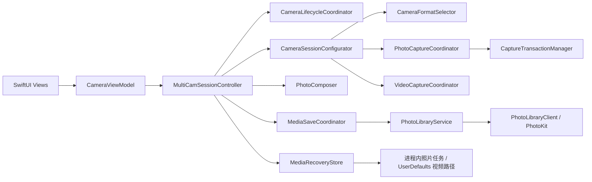

# 双摄相机架构

## 模块与数据流

- `CameraViewModel`：MainActor 上的 SwiftUI 状态入口；负责倒计时、设置持久化和 ScenePhase 转发。
- `MultiCamSessionController`：持有 `AVCaptureMultiCamSession`，协调照片／视频模式、启动／停止／受控重建、最近媒体和上层状态发布。它不直接实现 Session 图搭建、格式评分、PhotoOutput delegate、事务聚合、视频帧写入、PhotoKit、UserDefaults 或 Fake 图片绘制细节。
- `CameraSessionConfigurator`：筛选前后镜头组合，建立无自动连接的 MultiCam 图，并执行有限次数的成本验收。
- `CameraFormatSelector`：把 AVFoundation 格式映射为纯数据描述；按 MultiCam、30／24fps、分辨率、过高分辨率、binning 和视频像素格式评分。
- `PhotoCaptureCoordinator`、`PhotoCaptureProcessor`、`CaptureTransactionManager`：持有照片输出和 delegate，管理双路 UUID、重复／过期回调、4 秒超时、取消及相机原始文件数据。
- `VideoCaptureCoordinator`、`DualCameraVideoRecorder`：持有视频／音频输出、前摄帧新鲜度判定、AVAssetWriter 生命周期和临时文件清理。帧回调走独立的 `com.taoking.dualcamera.video-output` 队列；来自 Session 队列的生命周期调用一律 `sync` 进入该队列。合成布局由 `DualCameraLayoutEngine` 提供，与预览、照片同源。
- `CameraLifecycleCoordinator`：用 `wantsSessionRunning`、active/background 和中断状态计算幂等动作；媒体查看页不参与 Session 启动资格判定。
- `CameraAuthorizationService`：统一相机／麦克风授权结果；Controller 在回调后再次检查生命周期。
- `CameraRuntimeMonitor`：持有 Session 通知和设备压力 KVO。
- `CameraDiagnosticsProvider`：生成格式、帧率和两项成本的只读诊断快照。
- `MediaSaveCoordinator`：在独立 utility 队列执行媒体保存工作，以照片 UUID 或视频 URL 为任务 ID 去重，并将结果回传给 Controller。已接受任务会强持有协调器，同一 ID 的互斥一直保持到 PhotoKit 真实回调；不使用本地超时释放，避免不可取消的底层任务与重试重复写入。
- `MediaRecoveryStore`：在当前进程内强持有未成功完成照片的完整保存操作，上限为 5 个；视频把标准化 `.mov` 路径写入 `UserDefaults`，使 Controller 重建后仍能发现失败文件。它还将 failed 路径与正在保存的 URL 去重合并，为新录像提供 5 个／1 GiB 的容量闸门。
- `CameraNoticePolicy`：阻止较低优先级提示覆盖尚未处理的可操作错误；恢复优先级为重试 Session、打开设置、重试媒体，按钮执行时只按该条提示的唯一 ID 消费。
- `CameraNoticeCenter`：拥有提示状态与发布时序（唯一 ID 消费、按媒体任务解除、无操作提示的自动消失）。判定仍交给 `CameraNoticePolicy`；自动消失的调度器可注入以便测试。Controller 负责从 sessionQueue 切到主队列后再转交。
- `RecentMediaState`：最近媒体排序与视频去留的纯状态机，不接触 AVFoundation、PhotoKit、文件系统与界面。单调排序闸门、视频 saving/saved/failed 的去留决策、失败视频只自动重试一次、跨进程恢复的待删记账都在这里，因此可直接做单元测试。Controller 在 sessionQueue 上独占持有它，并把决策翻译成实际的删除、入队与发布动作。
- `PhotoLibraryService`：通过可注入的 `PhotoLibraryClient` 使用 add-only 权限并一次性写入资源；测试不调用真实 PhotoKit。
- `CameraPreferences`：注入 `UserDefaults`，测试 Suite 不污染用户设置。

## 串行性与状态

所有 Session、连接、设备锁和拍摄 Coordinator 状态变更均进入 `com.taoking.dualcamera.session` 串行队列；图片合成不在主线程执行。视频帧回调与合成在独立的 `com.taoking.dualcamera.video-output` 串行队列，避免逐帧渲染阻塞对焦、缩放、设备加锁和停止录制。照片 JPEG 处理与 PhotoKit 保存调度进入 `com.taoking.dualcamera.media-save` 独立队列，不阻塞 Session 队列；`@Published` 界面状态回到主队列。

界面仍聚合展示 `CameraState`，内部另行发布：

- `PhotoCaptureState`：idle／capturing／composing／failed；
- `VideoRecordingState`：idle／请求权限／recording／finishing／preview／failed；界面把关键过渡显示为准备、录制中和处理中；
- `MediaSaveState`：idle／saving／saved／failed。

单次拍照、视频或保存失败不会把长期 Session 永久改为 failed。`MediaSaveCoordinator` 拒绝相同 ID 的重复入队，但允许不同媒体任务保持独立；Controller 只让与最近媒体 ID 匹配的回调更新当前保存徽标、成功／失败提示和触感，避免旧任务覆盖新结果。视频另外以 URL 为键维护 saving/saved/failed 内部状态，文件删除决策不再依赖缩略图是否存在。`CameraNotice` 使用 `CameraNoticeAction` 表达打开设置或重试，不比较中文文案；有 action 的提示不参与普通提示的自动消失。每条提示携带唯一 ID，ViewModel 点击操作时按 ID 消费，旧界面事件无法清除后来发布的提示。

## 格式与成本降级

1. 前后摄分别生成 MultiCam 候选；照片允许系统照片格式，视频还要求双平面 420 视频像素格式。
2. 照片与录像分开评分。照片按格式可请求的最大照片尺寸倒序，binning 为减分项；录像以 1920×1080 为目标，binning 为加分项，因为成片统一合成到长边 1920 的画布。两种模式下 30fps 的权重都高于任何分辨率差异。
3. 先尝试最多 6 组 30fps 组合，再尝试最多 6 组 24fps 组合，不无限重试。
4. 每次完整提交 Session 图后读取 `hardwareCost` 和 `systemPressureCost`；两者都 `<= 1` 才接受，否则拆图并尝试下一组。
5. 每次尝试记录前后尺寸、fps、成本和是否接受。全部失败时返回明确的不支持状态。
6. 验收通过的组合按「前摄设备 + 后摄设备 + 采集模式」缓存，下次重建时排到候选最前并去重，命中后只需 1 轮。切换拍照／录像模式、切镜头、改质量都会重建，从零重跑成本搜索是起录等待的主要来源。全部候选都不达标时清除该键缓存。

重建 Session 后按镜头是否变化决定缩放的去留：同一颗镜头恢复用户此前的缩放（按新设备范围重新钳制），换镜头则重置为 1×。

运行期同时观察前后设备压力：nominal/fair 正常；serious 时把支持的输入降到 24fps且提示；critical 时禁止新录制并结束正在录制的视频；shutdown 时安全停止 Session。真机是否触发及降温恢复行为必须按验收清单确认。

## 拍照、质量与原始文件

创建前后 `AVCapturePhotoOutput` 时，快速模式把输出上限和单次请求设为 `.speed`；均衡模式请求 `.balanced`，若系统上限只有 `.speed` 则钳制为 `.speed`。质量变化只在照片空闲时受控重建 Session，视频切回照片模式后会重新应用设置。

照片输出与每次请求都显式设置 `maxPhotoDimensions` 为当前格式的上限，否则系统只给该格式的默认较小尺寸。这两项必须在连接建立之后设置：MultiCam 图用 `addOutputWithNoConnections` 搭建，output 在连接建立前没有视频源设备，此时写入会抛 `NSInvalidArgumentException` 直接终止进程，且该异常在 Swift 侧无法捕获。

合成画布长边由后摄源图推导，并同时受「不上采样」与 4032 上限约束；不足 1440 时按 1440 兜底。

`PhotoCaptureProcessor` 同时返回 `fileDataRepresentation()` 和用于合成的标准方向 `UIImage`。`CapturedPhotoSet` 保留 `backPhoto`、`frontPhoto` 和合成图：

- 合成图按 0.96 JPEG 质量编码；
- 前后单路照片优先把相机返回的文件 `Data` 原样交给 PhotoKit；
- 系统未返回数据时才记录日志并回退 JPEG，回退编码失败会指出前摄或后摄；
- 前摄实时预览镜像只作用于 PreviewConnection；合成镜像由 `PhotoComposer` 处理；单独保存的前摄相机文件保持自然方向。

共享事务只保证结果配对，不保证严格同步曝光。

## 非阻断保存与最近媒体

照片合成成功后，Controller 先用该事务 UUID 替换最近媒体，再把当次保存模式和照片快照交给 `MediaSaveCoordinator`。这个路径不停止 `AVCaptureMultiCamSession`，也不自动打开查看页；实时取景、对焦和下一次拍摄与保存队列解耦。Controller 在 Session 队列上为成功开始的视频和后续照片生成单调序号，只允许序号不早于当前媒体的结果替换缩略图。

照片保存操作在入队前先记入 `MediaRecoveryStore`，只有真实保存成功才移除。当前进程最多保留 5 个这类任务；拍照入口在上限前检查容量，已满时不启动新事务，而是发布带 `.retryMediaSaves` 操作的提示。

视频停止时，Controller 立即切回照片模式并在生命周期允许时重建取景 Session；`AVAssetWriter.finishWriting` 完成后，新 URL 才入队保存。因此视频处理和 PhotoKit 写入可在已恢复的取景之后继续。若用户已在 finishing 期间拍了更新照片，较早视频仍会保存，但不再回退最近媒体缩略图。

SwiftUI 默认只显示左下角最近媒体缩略图和 saving/saved/failed 徽标。用户主动点击后才覆盖显示照片或视频；照片可分享，保存失败的照片和视频可以用同一 ID 重试。如果失败回调属于已被替换的较早媒体，Controller 不改写最近徽标，而是发布指明“较早照片／视频”的错误提示条和“重试保存”操作。查看层的出现和消失不更改 Session 运行意图。

视频 URL 在 Controller 内有显式 saving/saved/failed 状态。替换最近媒体时，saving 视频记入待删集合，只在保存成功后删除；saved 视频可直接移除恢复索引并清理 `.mov`；failed 视频保留唯一文件并重试。这一显式状态机避免了保存完成回调与新媒体替换同时发生时的删除竞态。

失败视频的标准化路径写入 `UserDefaults`。新 Controller 在启动或重回 active 时枚举索引：文件仍存在则重试，不存在则删除无效路径。相机界面正常退出并调用 `stop` 时，saved 的最近视频立即清理，saving 的视频等真实回调成功后清理，failed 的视频继续保留恢复索引和缓存文件。若 `finishWriting` 在 Controller 退出后才返回，脱离界面的保存路径仍会写入相册，成功时清理缓存，失败时记录恢复路径。

开始新录像前，Controller 取 `MediaRecoveryStore` 的 failed 路径与 `MediaSaveCoordinator.activeVideoURLs` 的 saving URL，全部标准化后作并集，因此同一文件同时出现在两处也只计一个。并集已有 5 个或现存文件累计已达 1 GiB 时，录像入口发布 `.retryMediaSaves` 错误并返回，不创建 recorder，也不删除任何恢复文件。

## 布局与手势提交边界

`DualCameraLayoutEngine` 同时服务预览与照片成片。画中画拖动 `.changed` 只更新 ViewModel 内存和 SwiftUI/UIView 预览；`.ended` 才吸附、写 UserDefaults 并提交拍摄布局。位置提交不会重设镜像。尺寸、布局、比例和镜像由离散操作持久化。

缩放在 pinch 开始时记录基础 Zoom Factor，后续使用 `base × scale` 并钳制到设备范围，避免连续乘算。对焦点先限制到 0...1，再分别检查 point-of-interest 与具体 focus/exposure mode。录制期间允许对焦和缩放，两者都不触发 Session 重建。

## 生命周期与视频资源

- inactive：仅暂停新的异步启动资格，不立即停止或重建已经运行的 Session；
- background：取消倒计时／未完成照片工作，停止 Session，并安全结束录制；
- active：在用户仍希望运行且未中断时启动；照片／视频查看不再是启动否决条件；
- 授权回调：重新检查上述条件，避免回调把后台 Session 拉起；
- 中断结束：按同一状态机恢复；`mediaServicesWereReset` 重建前清空授权等待、Fake 录制、当次媒体序号和计时，并强制回到照片模式。普通 recorder 可取消并发布 idle；若旧 writer 已进入不可取消的 `finishWriting`，`VideoCaptureCoordinator.isFinishingRecording` 和 `VideoRecordingState.finishing` 都保持到旧回调，期间阻止新录像。

视频成片长边 1920，画幅与布局跟随用户设置：9:16 为 1080×1920，3:4 为 1440×1920，1:1 为 1920×1920；编码为 HEVC，码率按像素数缩放；音频采用采集端 `recommendedAudioSettingsForAssetWriter` 的推荐参数，与麦克风实际格式一致。布局引擎输出 UIKit 坐标，视频合成走 CoreImage，两者 y 轴方向相反，必须经 `coreImageRect(from:canvasHeight:)` 翻转。前摄帧与后摄帧时间差超过 0.2 秒即不参与合成，避免把过期画面持续贴在成片上。没有视频帧会明确失败；早于首个视频时间戳的音频被忽略；stop 只能消费一次 recorder。录制状态条在请求麦克风时显示准备、录制时显示红点和基于 `systemUptime` 的单调计时，停止后保留最后时长并显示处理。时长不足一小时格式化为 `MM:SS`，长录制为 `HH:MM:SS`。

录制写入失败时，未完成的 `.mov` 会立即清理；视频已生成但 PhotoKit 保存失败时，完整 `.mov` 则必须保留供恢复。`ManagedVideoPlayer` 在查看层消失时暂停并释放 PlayerItem。

## 自动验证边界

`DualCameraTests` 包含格式、质量、事务、生命周期、PhotoKit 适配、媒体保存去重、偏好、布局、合成和视频资源用例；`DualCameraUITests` 通过 Fake Camera 描述最近媒体、保存失败重试、录制状态与时长等核心界面路径。此处只说明测试边界，不代表本轮已执行。模拟器不能验证真实 MultiCam、成本数值、镜头组合、压力回调、对焦、麦克风音画或相册最终文件方向，这些属于 iPhone 16 Pro 真机验收。
