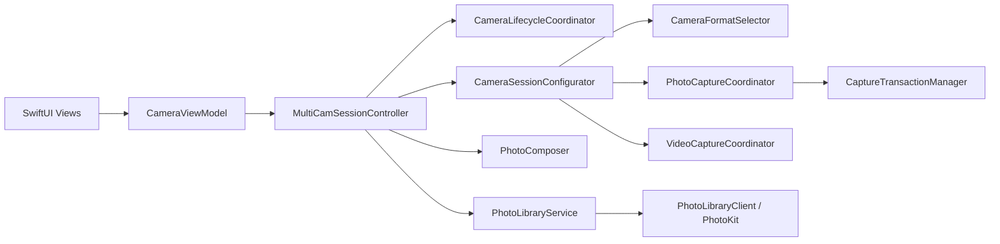

# 双摄相机架构

## 模块与数据流

- `CameraViewModel`：MainActor 上的 SwiftUI 状态入口；负责倒计时、设置持久化和 ScenePhase 转发。
- `MultiCamSessionController`：持有 `AVCaptureMultiCamSession`，协调照片／视频模式、启动／停止／受控重建和上层状态发布。文件由改造前 1217 行降为 975 行，不再包含 Session 图搭建、格式评分、PhotoOutput delegate、事务聚合、视频帧写入、PhotoKit 实现、UserDefaults 或 Fake 图片绘制细节。
- `CameraSessionConfigurator`：筛选前后镜头组合，建立无自动连接的 MultiCam 图，并执行有限次数的成本验收。
- `CameraFormatSelector`：把 AVFoundation 格式映射为纯数据描述；按 MultiCam、30／24fps、分辨率、过高分辨率、binning 和视频像素格式评分。
- `PhotoCaptureCoordinator`、`PhotoCaptureProcessor`、`CaptureTransactionManager`：持有照片输出和 delegate，管理双路 UUID、重复／过期回调、4 秒超时、取消及相机原始文件数据。
- `VideoCaptureCoordinator`、`DualCameraVideoRecorder`：持有视频／音频输出、近邻前摄帧、AVAssetWriter 生命周期和临时文件清理。
- `CameraLifecycleCoordinator`：用 `wantsSessionRunning`、active/background、媒体预览和中断状态计算幂等动作。
- `CameraAuthorizationService`：统一相机／麦克风授权结果；Controller 在回调后再次检查生命周期。
- `CameraRuntimeMonitor`：持有 Session 通知和设备压力 KVO。
- `CameraDiagnosticsProvider`：生成格式、帧率和两项成本的只读诊断快照。
- `PhotoLibraryService`：通过可注入的 `PhotoLibraryClient` 使用 add-only 权限并一次性写入资源；测试不调用真实 PhotoKit。
- `CameraPreferences`：注入 `UserDefaults`，测试 Suite 不污染用户设置。

## 串行性与状态

所有 Session、连接、设备锁和 Coordinator 状态变更均进入 `com.taoking.dualcamera.session` 串行队列；图片合成和视频帧渲染不在主线程执行；`@Published` 界面状态回到主队列。

界面仍聚合展示 `CameraState`，内部另行发布：

- `PhotoCaptureState`：idle／capturing／composing／failed；
- `VideoRecordingState`：idle／请求权限／recording／finishing／preview／failed；
- `MediaSaveState`：idle／saving／failed。

单次拍照、视频或保存失败不会把长期 Session 永久改为 failed。`CameraNotice` 使用 `CameraNoticeAction` 表达打开设置或重试，不比较中文文案。

## 格式与成本降级

1. 前后摄分别生成 MultiCam 候选；照片允许系统照片格式，视频还要求双平面 420 视频像素格式。
2. 每个帧率内优先接近 1280×720；低于目标和高于 1080p 会被额外降权。
3. 先尝试最多 6 组 30fps 组合，再尝试最多 6 组 24fps 组合，不无限重试。
4. 每次完整提交 Session 图后读取 `hardwareCost` 和 `systemPressureCost`；两者都 `<= 1` 才接受，否则拆图并尝试下一组。
5. 每次尝试记录前后尺寸、fps、成本和是否接受。全部失败时返回明确的不支持状态。

运行期同时观察前后设备压力：nominal/fair 正常；serious 时把支持的输入降到 24fps且提示；critical 时禁止新录制并结束正在录制的视频；shutdown 时安全停止 Session。真机是否触发及降温恢复行为必须按验收清单确认。

## 拍照、质量与原始文件

创建前后 `AVCapturePhotoOutput` 时，快速模式把输出上限和单次请求设为 `.speed`；均衡模式请求 `.balanced`，若系统上限只有 `.speed` 则钳制为 `.speed`。质量变化只在照片空闲时受控重建 Session，视频切回照片模式后会重新应用设置。

`PhotoCaptureProcessor` 同时返回 `fileDataRepresentation()` 和用于合成的标准方向 `UIImage`。`CapturedPhotoSet` 保留 `backPhoto`、`frontPhoto` 和合成图：

- 合成图按 0.96 JPEG 质量编码；
- 前后单路照片优先把相机返回的文件 `Data` 原样交给 PhotoKit；
- 系统未返回数据时才记录日志并回退 JPEG，回退编码失败会指出前摄或后摄；
- 前摄实时预览镜像只作用于 PreviewConnection；合成镜像由 `PhotoComposer` 处理；单独保存的前摄相机文件保持自然方向。

共享事务只保证结果配对，不保证严格同步曝光。

## 布局与手势提交边界

`DualCameraLayoutEngine` 同时服务预览与照片成片。画中画拖动 `.changed` 只更新 ViewModel 内存和 SwiftUI/UIView 预览；`.ended` 才吸附、写 UserDefaults 并提交拍摄布局。位置提交不会重设镜像。尺寸、布局、比例和镜像由离散操作持久化。

缩放在 pinch 开始时记录基础 Zoom Factor，后续使用 `base × scale` 并钳制到设备范围，避免连续乘算。对焦点先限制到 0...1，再分别检查 point-of-interest 与具体 focus/exposure mode。录制期间允许对焦和缩放，两者都不触发 Session 重建。

## 生命周期与视频资源

- inactive：仅暂停新的异步启动资格，不立即停止或重建已经运行的 Session；
- background：取消倒计时／未完成照片工作，停止 Session，并安全结束录制；
- active：仅在用户仍希望运行、无照片／视频预览且未中断时启动；
- 授权回调：重新检查上述条件，避免回调把后台 Session 拉起；
- 中断结束：按同一状态机恢复；`mediaServicesWereReset` 只在允许运行时重建。

视频保持固定画中画 720×1280 H.264 + AAC：没有视频帧会明确失败；早于首个视频时间戳的音频被忽略；stop 只能消费一次 recorder。临时 `.mov` 会在写入失败、用户关闭预览、保存成功、保存失败后放弃、新录制覆盖旧结果以及 Controller 释放时删除。`ManagedVideoPlayer` 在预览消失时暂停并释放 PlayerItem。

## 自动验证边界

`DualCameraTests` 覆盖格式、质量、事务、生命周期、PhotoKit 适配、偏好、布局、合成和视频资源；`DualCameraUITests` 通过 Fake Camera 覆盖核心界面路径。模拟器不能验证真实 MultiCam、成本数值、镜头组合、压力回调、对焦、麦克风音画或相册最终文件方向，这些属于 iPhone 16 Pro 真机验收。
